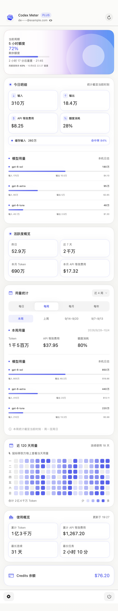
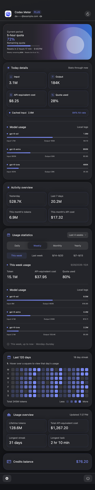
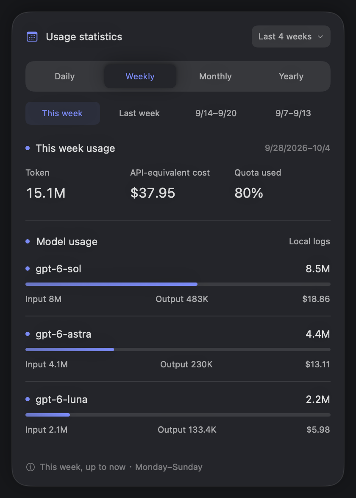
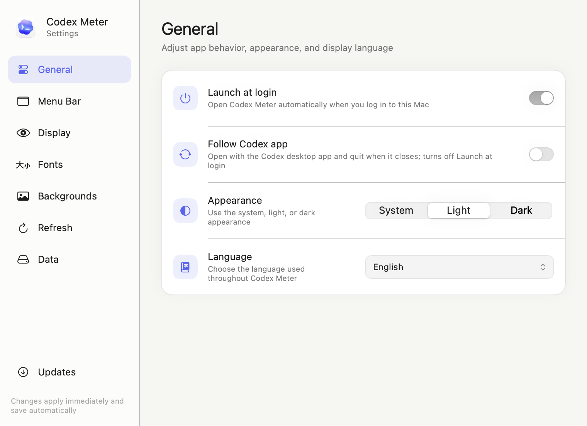
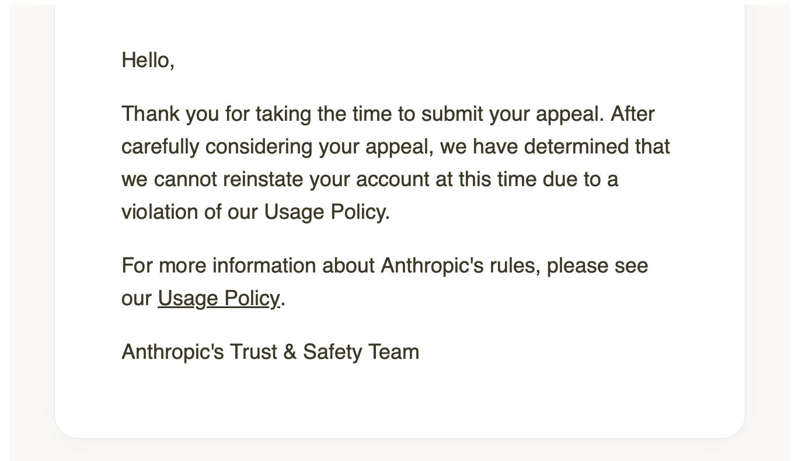

# Codex Meter

[简体中文](README.md) · [繁體中文](README.zh-Hant.md) · [English](README.en.md) · [日本語](README.ja.md) · [한국어](README.ko.md) · Español

Codex Meter es una utilidad nativa para la barra de menús de macOS que permite consultar rápidamente las ventanas de cuota y la actividad de tokens de una cuenta de ChatGPT/Codex. Lee los datos mediante la interfaz JSON-RPC `app-server` del Codex CLI local, reutiliza la sesión existente y nunca lee ni guarda tokens de acceso.

> Codex Meter es un proyecto independiente de código abierto. No es un producto oficial de OpenAI ni cuenta con su soporte o respaldo.

## Capturas de pantalla

| Chino simplificado · Claro | Inglés · Oscuro |
| --- | --- |
| [](docs/images/overview-zh-Hans-light.png) | [](docs/images/overview-en-dark.png) |

> Ambas capturas muestran las siete tarjetas del panel. Haz clic para verlas a tamaño completo. Todas las imágenes usan datos de demostración y no contienen información de cuentas reales.

| Estadísticas de uso · Inglés · Oscuro | Ajustes · Inglés · Claro |
| --- | --- |
| [](docs/images/usage-statistics-en-dark.png) | [](docs/images/settings-en-light.png) |

> Las estadísticas muestran los tokens, el coste equivalente de API, el consumo de cuota y el desglose por modelo del periodo seleccionado. Los ajustes incluyen la opción de iniciar y cerrar Codex Meter junto con la app Codex.

## Funciones

- Da prioridad a la cuota restante de cinco horas de Codex en la barra de menús y usa la cuota semanal cuando es la única ventana que devuelve la cuenta
- Muestra un anillo de progreso del mismo color que la tarjeta de cuota y lo actualiza según el porcentaje restante; su tamaño se ajusta entre 12 y 22 pt con vista previa inmediata
- Adapta las tarjetas a las ventanas devueltas por la API: la cuota de cinco horas muestra la cuenta atrás y la hora de restablecimiento, y la semanal presenta el porcentaje restante y la fecha en una sola línea
- Muestra el detalle de hoy, ayer, los últimos 7 días, este mes y los totales de tokens y coste equivalente de API, además de las rachas y la tarea más larga
- Presenta un mapa de calor de 120 días con cuadros compactos alineados por semana y detalles diarios al pasar el cursor
- Actualiza el recuento local de hoy cada 5 segundos de forma incremental desde los registros de sesión de Codex y muestra entrada, salida, entrada en caché y coste equivalente de API en USD
- Muestra el porcentaje estimado de cuota consumida en el detalle de hoy; en las estadísticas de uso presenta juntos los tokens, el coste equivalente de API y el consumo de cuota del periodo seleccionado
- Añade al detalle de hoy los tokens de entrada y salida, el coste equivalente de API y la proporción de uso de cada modelo; las estadísticas usan el mismo formato para el día, semana, mes o año seleccionado
- Muestra el saldo de Codex Credits convertido a su valor en USD
- Permite mostrar u ocultar todas las tarjetas del panel principal y reordenarlas mediante arrastre, con guardado automático
- Admite actualización manual, intervalos predefinidos y un intervalo personalizado de 1 a 1.440 minutos
- Permite iniciar con la sesión o iniciar y cerrar junto con la app de escritorio Codex, y elegir la apariencia del sistema, clara u oscura
- Da prioridad al CLI incluido en la app de escritorio Codex/ChatGPT para consultar la cuota, y a la ruta manual del CLI cuando se ha especificado una
- Permite ajustar el tamaño de valores, títulos y etiquetas o notas para las tarjetas de contenido, juntas o por separado, con controles independientes para la tarjeta de cuota
- Permite crear varios conjuntos de fondos de cuota, recortar imágenes e iconos para los estados suficiente, atención y bajo, y cambiarlos automáticamente según la cuota restante
- Comprueba actualizaciones cada 6 horas con Sparkle y las verifica, instala y reinicia dentro de la app
- Oculta el correo de la cuenta por defecto y solo muestra la dirección completa al hacer clic
- Conserva los últimos datos correctos si falla la consulta de cuota; incluso si falla la primera consulta, muestra el uso local y permite volver a intentarlo
- Guarda las estadísticas, los ajustes y los fondos en SQLite local y permite eliminar registros de uso por antigüedad desde Ajustes

## Idiomas de la interfaz

En el primer inicio se usa el idioma preferido del sistema, con inglés como alternativa si no está admitido. Puedes cambiarlo en Ajustes. La aplicación admite actualmente:

- Chino simplificado (`zh-Hans`)
- Chino tradicional (`zh-Hant`)
- Inglés (`en`)
- Japonés (`ja`)
- Coreano (`ko`)
- Español (`es`)

## Descarga

[⬇️ Descargar Codex Meter v1.7.0 (macOS Universal 2)](https://github.com/JTXYH/codex-meter/releases/download/v1.7.0/CodexMeter-1.7.0-macOS.zip)

Esta compilación admite Macs con Apple Silicon e Intel. Descarga y extrae el ZIP y mueve `CodexMeter.app` a la carpeta Aplicaciones. [Consulta las notas de la versión v1.7.0](https://github.com/JTXYH/codex-meter/releases/tag/v1.7.0).

### Si macOS bloquea la aplicación al abrirla por primera vez

La compilación actual usa una firma ad hoc y no está notarizada por Apple. Si al abrirla por primera vez aparece «Apple no puede comprobar si la app contiene software malicioso» o «no se puede verificar el desarrollador», comprueba primero que la aplicación procede de los [GitHub Releases](https://github.com/JTXYH/codex-meter/releases) de este repositorio y utiliza uno de los siguientes métodos.

**Método 1: Abrirla desde Finder**

1. Abre la carpeta Aplicaciones en Finder y localiza `CodexMeter.app`.
2. Haz Control-clic o clic con el botón derecho en la aplicación y selecciona **Abrir**.
3. Vuelve a hacer clic en **Abrir** en el cuadro de confirmación. Después de autorizarla una vez, podrás iniciarla normalmente con un doble clic.

**Método 2: Permitirla desde Ajustes del Sistema**

1. Haz doble clic una vez en `CodexMeter.app` y cierra el aviso de macOS.
2. Abre el menú Apple ** → Ajustes del Sistema → Privacidad y seguridad**.
3. Desplázate hasta Seguridad, busca el mensaje sobre Codex Meter y haz clic en **Abrir igualmente**.
4. Autentícate cuando se te solicite y haz clic en **Abrir**. El botón **Abrir igualmente** suele estar disponible durante aproximadamente una hora después de intentar iniciar la aplicación.

Consulta [Soporte técnico de Apple: Abrir apps de forma segura en el Mac](https://support.apple.com/es-es/102445) para obtener más información. Si macOS indica expresamente que la aplicación «dañará el ordenador» o detecta software malicioso, no ignores el aviso; elimina el archivo actual y vuelve a descargarlo desde el Release oficial.

Desde la primera versión que incluye Sparkle, los paquetes de actualización se firman con Ed25519 y se instalan dentro de la aplicación. Si una versión antigua todavía descarga mediante el navegador, instala manualmente una versión de transición una sola vez; las actualizaciones posteriores no requieren repetir el mismo aviso de Gatekeeper.

## Requisitos

- macOS 14 Sonoma o posterior
- [Codex CLI](https://github.com/openai/codex) disponible en la app de escritorio Codex/ChatGPT o instalado por separado, con una sesión de ChatGPT iniciada
- Swift 6 / Xcode 16 o posterior (solo para compilar desde el código fuente)

Codex Meter da prioridad a la ruta manual del CLI, después busca el `codex` incluido en la app de escritorio Codex/ChatGPT, en `PATH`, `~/.local/bin/codex`, `~/.npm-global/bin/codex`, las ubicaciones habituales de Homebrew y las demás rutas de ejecutables de las apps.

## Instalación

Después de clonar o descargar el repositorio, ejecuta:

```bash
cd codex-meter
chmod +x scripts/build-app.sh
./scripts/build-app.sh
```

La aplicación se genera en `dist/CodexMeter.app`. Ábrela directamente o muévela a la carpeta Aplicaciones.

Durante el desarrollo también puedes ejecutar:

```bash
swift run CodexMeter
```

## Guía de uso

1. Comprueba que has iniciado sesión con tu cuenta de ChatGPT en Codex CLI o en la app de escritorio Codex.
2. Abre Codex Meter. En la barra de menús aparecerán un anillo de cuota de color y la cuota restante de cinco horas; si solo hay cuota semanal, la aplicación cambiará automáticamente a ella.
3. Haz clic en el elemento de la barra para consultar las cuotas, el detalle de hoy y el uso por modelo, la actividad, el mapa de calor y el resumen de uso.
4. En Estadísticas de uso, elige día, semana, mes o año y el intervalo de visualización. Haz clic en una etiqueta de fecha para ver los tokens, el coste equivalente de API, el consumo estimado de cuota y el desglose por modelo de ese periodo.
5. Usa el botón de actualización de la esquina superior derecha para leer los datos inmediatamente. Si falla la consulta de cuota, puedes volver a intentarlo.
6. Haz clic en el correo oculto para mostrarlo temporalmente. Al cerrar el panel vuelve a ocultarse.
7. Abre Ajustes con el engranaje de la esquina inferior izquierda para configurar el inicio, la apariencia, el idioma, el tamaño del anillo, la visibilidad y el orden de las tarjetas, el texto, los fondos de cuota, el intervalo de actualización y los datos locales. Iniciar y cerrar junto con Codex e iniciar con la sesión son opciones excluyentes: activar una desactiva la otra. Si macOS lo solicita, permite la ejecución en segundo plano en los ítems de inicio de Ajustes del Sistema.
8. En Texto, ajusta los tamaños de valores, títulos y etiquetas o notas de las tarjetas de uso juntas o por separado. La tarjeta de cuota tiene controles independientes. Los cambios se aplican al instante, se guardan automáticamente y pueden restablecerse.
9. Cierra la aplicación con el botón de encendido de la esquina inferior derecha.

## Datos y privacidad

- El resumen de la cuenta procede de `account/read`.
- Las ventanas de cuota y el saldo de Credits proceden de `account/rateLimits/read`; el porcentaje representa la parte utilizada de cada ventana y los Credits se convierten del saldo devuelto por el servidor a USD.
- El consumo de cuota de hoy se estima a partir de las lecturas de cuota en los registros locales de Codex. Se agrupa según la ventana principal actual y se evitan las diferencias que cruzan un restablecimiento. El uso en otros dispositivos y los retrasos de sincronización pueden afectar al resultado. Solo se guardan los metadatos de hora y porcentaje en SQLite local, sin contenido de conversaciones.
- La actividad de tokens y el mapa de calor proceden de `account/usage/read`; son estadísticas de actividad, no límites de cuota.
- Los tokens de hoy y el coste equivalente de API acumulado solo leen eventos de recuento de tokens de las sesiones y archivos de Codex disponibles localmente; no guardan ni muestran conversaciones. Las estadísticas de hoy se actualizan de forma independiente sin esperar al análisis del historial. El coste acumulado lee el historial en segundo plano la primera vez y después comprueba los cambios de archivos cada 5 segundos, calculando solo los registros nuevos. Los totales diarios, los costes y las posiciones de lectura se guardan en SQLite local para reutilizar el progreso al reiniciar. La cobertura puede diferir del total de tokens de la cuenta que devuelve el servidor.
- El coste equivalente de API se estima con las tarifas por modelo incluidas en la aplicación y distingue entrada normal, lectura y escritura de caché, salida y contexto largo cuando el modelo lo admite. Las rutas internas de Codex no reconocidas usan las tarifas de GPT-5.6 Sol. El uso histórico se calcula con las tarifas incluidas actualmente; no se incluyen costes de herramientas, modo Fast ni recargos regionales. No representa cargos reales de la suscripción de ChatGPT.
- Las estadísticas admiten agrupación diaria, semanal, mensual y anual. La diaria excluye hoy y muestra los 7 / 14 / 30 días anteriores desde ayer. La semanal va de lunes a domingo en hora local y muestra las últimas 4 / 8 / 12 semanas (4 por defecto). La mensual muestra los últimos 3 / 6 / 12 meses y la anual los últimos 3 / 5 años o todos los años. Las semanas, meses y años incluyen hoy; la semana actual se calcula hasta el momento. El uso por modelo de hoy aparece en Detalle de hoy. Cada agrupación recuerda su intervalo por separado; al hacer clic en una etiqueta de fecha se muestran los tokens, el coste equivalente de API, el consumo de cuota y el desglose por modelo de ese periodo. El consumo de cuota se estima a partir de los cambios en las lecturas del periodo seleccionado y aparece como «—» si faltan registros que permitan calcularlo. La antigua selección por hora migra automáticamente a diaria, conservando la visibilidad, el orden y los tamaños de texto de las tarjetas.
- La tarea más larga usa `longestRunningTurnSec` de la cuenta actual devuelto por el servidor. El valor está en segundos y la interfaz lo muestra hasta los minutos; corresponde a una sola tarea, no a la duración acumulada de una conversación.
- La aplicación no accede a `auth.json`, no guarda tokens de acceso, no registra respuestas completas del servidor y no sube datos adicionales.
- Los inicios de sesión mediante API Key o Amazon Bedrock pueden no devolver cuotas o actividad de ChatGPT. Usa un inicio de sesión de ChatGPT para ver estas métricas.

### Datos locales y limpieza

- Las estadísticas, los ajustes, la configuración de fondos y sus imágenes se guardan en `~/Library/Application Support/CodexMeter/meter.sqlite`. SQLite usa WAL y transacciones, y solo actualiza las posiciones de lectura y los totales diarios de los registros que han cambiado. La cuota actual de la cuenta, las instantáneas de la interfaz y las imágenes decodificadas se mantienen en memoria.
- El primer inicio migra los antiguos ajustes de UserDefaults, las imágenes de fondo y `~/Library/Caches/CodexMeter/usage-{today,history}.json`. Los datos antiguos correspondientes solo se eliminan después de escribirlos correctamente en la base de datos. Los registros de sesión y la información de inicio de sesión de Codex, así como el estado gestionado por macOS/Sparkle, quedan fuera de esta base de datos.
- Detalle de hoy y Resumen de actividad son tarjetas independientes que pueden activarse, ocultarse y reordenarse en Ajustes → Visualización. Al actualizar se conserva el orden existente; la nueva tarjeta de actividad se añade después del detalle de hoy y hereda su estado de visibilidad anterior.
- Ajustes → Datos muestra el tamaño total de la base de datos (incluido WAL), el tamaño de los fondos y el intervalo de fechas de las estadísticas guardadas. Puedes eliminar estadísticas locales anteriores a 7, 30, 90, 180 o 365 días, a un número personalizado de días, o todas las estadísticas registradas. Antes de la limpieza se muestra la fecha límite exacta y después se recupera espacio. Se conservan los ajustes, los fondos y los registros originales de Codex; la cuota de la cuenta y las estadísticas del servidor no se ven afectadas.
- La fecha límite de limpieza se guarda de forma persistente. Los eventos antiguos eliminados no se vuelven a importar al reiniciar, mover o reescribir registros. El uso nuevo se sigue registrando normalmente. Se conservan algunas posiciones de lectura para evitar importaciones duplicadas, por lo que la base de datos no queda en 0 bytes aunque se eliminen todas las estadísticas.

## Desarrollo y pruebas

```bash
swift test
swift build -c release
```

El proyecto usa Swift Package Manager y Sparkle 2 para las actualizaciones dentro de la app. Verifica que las pruebas y la compilación release terminen correctamente antes de enviar cambios. El proceso de publicación se describe en la [guía de versiones](docs/releasing.md).

## Seguridad

No publiques tokens de acceso, `auth.json`, direcciones de correo completas ni respuestas sin procesar de App Server en un Issue público. Si GitHub Private Vulnerability Reporting está habilitado, informa de forma privada desde **Security → Advisories → Report a vulnerability**.

## Preguntas frecuentes (FAQ)

### ¿Por qué no se admite Claude Code?



## Licencia

Codex Meter se distribuye bajo la [Licencia MIT](LICENSE).
