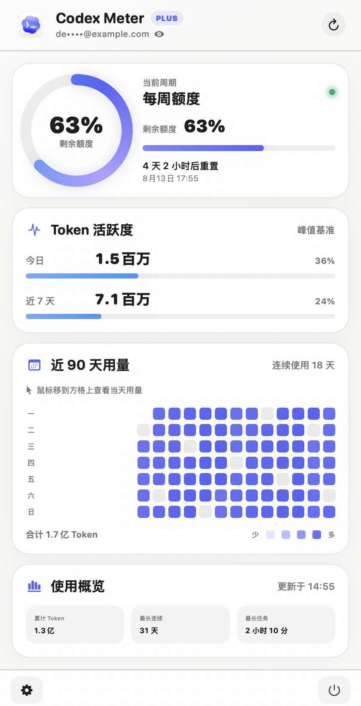
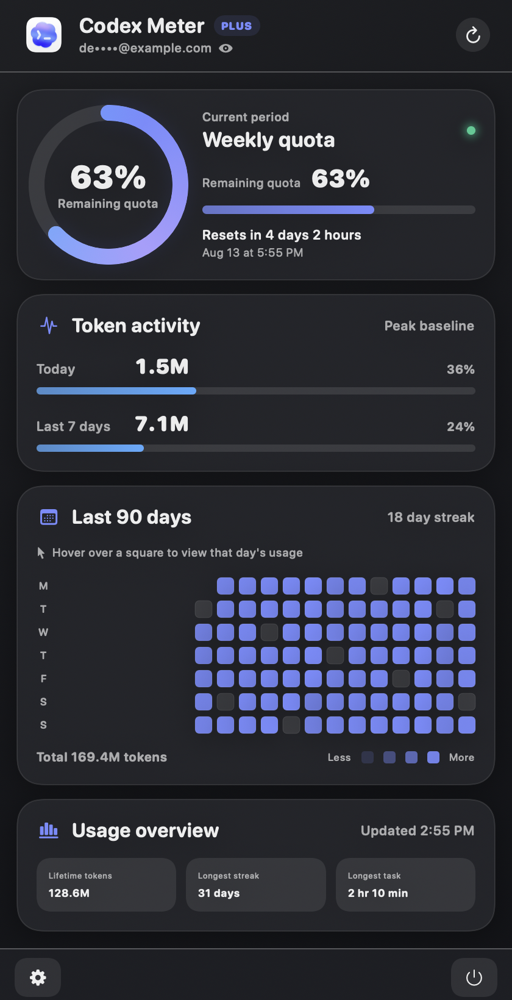
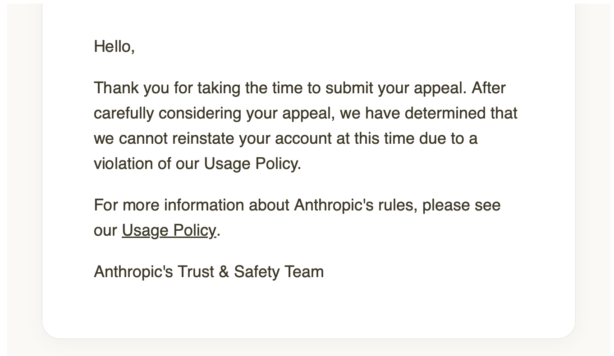

# Codex Meter

[简体中文](README.md) · [繁體中文](README.zh-Hant.md) · [English](README.en.md) · 日本語 · [한국어](README.ko.md) · [Español](README.es.md)

Codex Meter は、ChatGPT/Codex アカウントの割り当てウィンドウと token アクティビティをすばやく確認できるネイティブ macOS メニューバーユーティリティです。ローカルの Codex CLI `app-server` JSON-RPC インターフェースからデータを読み取り、既存のログイン状態を再利用します。アクセストークンは読み取りも保存もしません。

> Codex Meter は独立したオープンソースプロジェクトです。OpenAI の公式製品ではなく、OpenAI によるサポートまたは推奨を意味しません。

## スクリーンショット

| 簡体中国語 · ライト | English · Dark |
| --- | --- |
|  |  |

> 画像はすべて合成デモデータを使用しており、実際のアカウント情報は含まれません。

## 主な機能

- メニューバーに Codex の週間残量を常時表示
- すべての割り当てウィンドウ、残りの割合、リセットまでの時間を表示
- 今日、過去 7 日間、累計の token アクティビティと90日間ヒートマップ
- 今日のデータがない場合は昨日に自動切り替え
- 手動更新、プリセット、1〜1,440分のカスタム更新間隔
- システム、ライト、ダークの外観
- 起動時と 6 時間ごとに Cloudflare 経由で GitHub Release を確認し、新版のダウンロードを案内
- アカウントのメールアドレスを初期状態でマスク表示
- 更新失敗時に前回の成功データを保持

## 対応言語

デフォルトは簡体中国語です。現在の対応言語：

- 簡体中国語 (`zh-Hans`)
- 繁体中国語 (`zh-Hant`)
- English (`en`)
- 日本語 (`ja`)
- 한국어 (`ko`)
- Español (`es`)

## ダウンロード

[⬇️ Codex Meter v1.0.0 をダウンロード（macOS Universal 2）](https://github.com/JTXYH/codex-meter/releases/download/v1.0.0/CodexMeter-1.0.0-macOS.zip)

Apple Silicon と Intel Mac の両方に対応しています。ZIP を解凍し、`CodexMeter.app` を「アプリケーション」フォルダに移動してください。[v1.0.0 のリリースノート](https://github.com/JTXYH/codex-meter/releases/tag/v1.0.0)。

> 現在のビルドは ad-hoc 署名で、Apple の notarization は未実施です。初回起動が macOS にブロックされた場合は、Finder でアプリを Control クリックし、「開く」を選んで再度確認してください。

## 動作要件

- macOS 14 Sonoma 以降
- [Codex CLI](https://github.com/openai/codex) がインストール済みで、ChatGPT アカウントでログイン済みであること
- Swift 6 / Xcode 16 以降（ソースからビルドする場合のみ）

Codex Meter は `PATH`、`~/.local/bin/codex`、`~/.npm-global/bin/codex`、Homebrew の一般的な場所、Codex/ChatGPT App 内の `codex` 実行ファイルを順に探します。

## インストール

リポジトリをクローンまたはダウンロードした後、次を実行します。

```bash
cd codex-meter
chmod +x scripts/build-app.sh
./scripts/build-app.sh
```

`dist/CodexMeter.app` が作成されます。直接開くか、「アプリケーション」フォルダに移動してください。

開発中は次のコマンドで直接実行できます。

```bash
swift run CodexMeter
```

## 使い方

1. Codex CLI を起動し、ChatGPT アカウントでログイン済みか確認します。
2. Codex Meter を起動すると、メニューバーにアイコンと週間残量が表示されます。
3. メニューバー項目をクリックし、割り当て、token アクティビティ、ヒートマップ、使用概要を確認します。
4. 右上の更新ボタンですぐにデータを更新できます。
5. マスクされたメールアドレスをクリックすると一時的に全体を表示します。パネルを閉じると再度マスクされます。
6. 左下の歯車から設定を開き、外観、言語、自動更新間隔を変更できます。
7. 右下の電源ボタンで終了します。

## データとプライバシー

- アカウント概要は `account/read` から取得します。
- 割り当てウィンドウは `account/rateLimits/read` から取得し、パーセントは各ウィンドウの使用済み割合です。
- Token アクティビティとヒートマップは `account/usage/read` から取得します。これらは割り当て上限とは異なります。
- `auth.json` へのアクセス、アクセストークンの保存、サーバー応答全体の記録、追加データの送信は行いません。
- API Key または Amazon Bedrock ログインでは ChatGPT の割り当てやアクティビティが返らない場合があります。これらの指標には ChatGPT ログインを使用してください。

## 開発とテスト

```bash
swift test
swift build -c release
```

このプロジェクトは Swift Package Manager を使用し、現在サードパーティパッケージに依存していません。変更を送信する前に、テストと release ビルドが通ることを確認してください。

## セキュリティ

公開 Issue にアクセストークン、`auth.json`、メールアドレス全体、または App Server の生レスポンスを貼り付けないでください。GitHub Private Vulnerability Reporting が有効な場合は、**Security → Advisories → Report a vulnerability** から非公開で報告してください。

## よくある質問（FAQ）

### Claude Code がサポートされていないのはなぜですか？



## ライセンス

Codex Meter は [Apache License 2.0](LICENSE) で提供されます。
